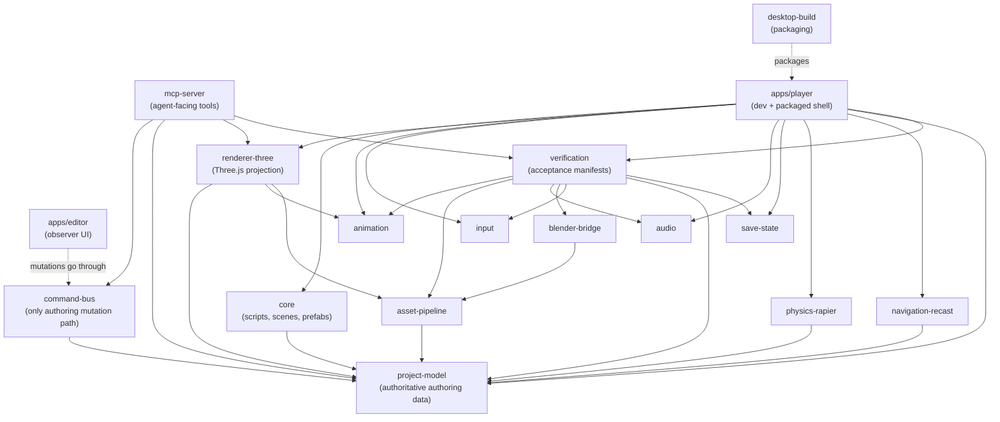
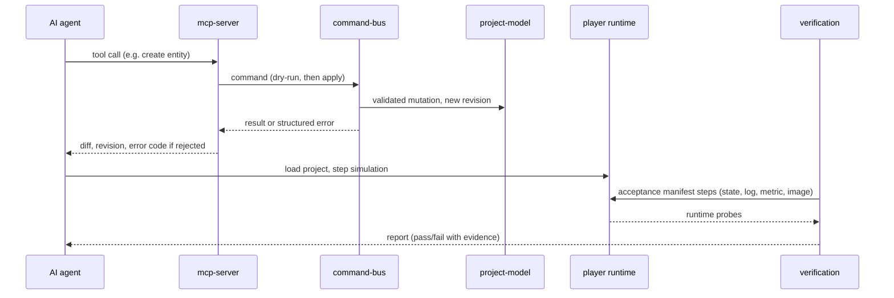

# System map

This is the compact architectural map for future agents.

## Dependency direction

```text
project-model
    ^
    |
command-bus
    ^
    |
agent/editor adapters
    |
    +--------------------------+
    |                          |
    v                          v
runtime orchestration      observer editor
    |
    +--> renderer-three
    +--> animation
    +--> input
    +--> audio
    +--> save-state
    +--> physics adapter
    +--> navigation adapter
    +--> asset handles
    |
    v
verification probes
    |
    v
desktop build / packaged executable
```

The arrows indicate dependency/authority direction, not necessarily npm dependency edges.

### Diagram: packages and apps

The same map as a rendered graph. Solid arrows are real workspace dependencies read from each `package.json` (`A --> B` means A depends on B). Dashed arrows are architectural rules that are not npm edges (`apps/editor` and `packages/desktop-build` have no `package.json` of their own yet). `reference-game` and the other `examples/` are left out.



### Diagram: authoring mutation and proof

An agent never edits the project file or the Three.js scene directly. A change is a command, it is validated and recorded by the command bus, and "done" is decided by verification against the running game, not by the edit succeeding.



## Package responsibilities

### `packages/project-model`

Owns:
- stable IDs;
- schema/versioning;
- serializable scene/entity/component data;
- migrations;
- deterministic serialization.

Must not depend on:
- Three.js;
- Electron;
- React;
- runtime-only handles.

### `packages/command-bus`

Owns:
- supported authoring mutations;
- revisions;
- transactions;
- dry-run/diff/undo semantics;
- mutation validation.

All editor and MCP authoring writes go through this path.

### `packages/renderer-three`

Owns:
- projection from project/runtime data to Three.js;
- renderer-specific resource lifecycle.

Must not become the project database.

### `packages/mcp-server`

Owns:
- agent-facing semantic tools;
- narrow queries;
- runtime/tool adapters.

Must remain provider-neutral.

### `apps/editor`

Owns human observation/debug UI.

Rules:
- no privileged hidden authoring state;
- mutations call command bus;
- viewport is a projection;
- editor correctness must not be required by the shipped game.

### `apps/player`

Owns development/packaged game shell.

The production player should not carry editor/agent dependencies unless explicitly needed.

### `packages/asset-pipeline`

Owns:
- asset identity;
- import recipes;
- hashes/cache keys;
- dependencies/invalidation;
- validation/normalization metadata.

### `packages/blender-bridge`

Owns Blender-specific automation.

Blender should be used as a DCC/import worker, not as Kinetra's runtime.

### `packages/animation`

Owns engine-neutral animation semantics:
- skeleton profiles;
- retarget metadata;
- root motion;
- animation graph.

Three.js AnimationMixer-specific code should live behind an adapter/runtime layer.

### `packages/core`

Owns generic game/runtime lifecycle contracts:
- scripts;
- scenes;
- prefabs and overrides.

Keep it small. Do not turn it into a god package.

### `packages/input`

Owns named actions and physical binding/remapping.

Gameplay code should depend on semantic actions, not hard-coded keys.

### `packages/audio`

Owns bus/mixer semantics.

Runtime WebAudio objects should be adapters over these semantics.

### `packages/save-state`

Owns versioned save/settings data and migrations.

Storage backends are adapters.

### `packages/verification`

Owns completion proof:
- acceptance manifests;
- semantic steps;
- state/log/metric/image assertions;
- reports.

It should consume runtime probes instead of reaching into internal globals.

### Physics / navigation packages

These are adapter boundaries. Project data should use Kinetra-owned concepts, not persist raw Rapier/Recast handles.

### `packages/desktop-build`

Owns packaging/release/platform integration contracts.

Steam/signing remain optional adapters requiring external credentials.

## Authority rules

1. Project model is authoritative for authoring data.
2. Command bus is authoritative for authoring mutation.
3. Runtime objects are disposable projections.
4. Verification determines completion.
5. Packaged executable is the final shipping truth.
