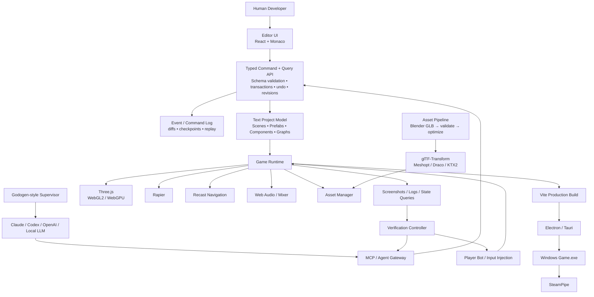

# Building an AI-First Three.js Game Engine/Editor

**Research snapshot: September 19, 2026.**

## Executive summary

The project you are describing is technically credible, but the winning scope is **not “build another Unity.”** The right product is an **AI-native game-development runtime and editor whose primary programming surface is TypeScript + Three.js, whose primary mutation surface is a typed command API/MCP, and whose output is a self-contained Windows game build**.

After reviewing the current Three.js ecosystem, AI-first game projects, desktop runtimes, asset tooling, and agent automation projects, my recommended stack is:

| Layer | Recommendation |
|---|---|
| Rendering | **Three.js**, with a renderer abstraction around WebGL2/WebGPU |
| Language | **TypeScript everywhere possible** |
| Game data | Text-based JSON/JSONC + TypeScript; stable IDs; versioned schemas |
| Engine model | Entity/component model separate from the raw Three.js scene graph |
| Physics | **Rapier** |
| Navigation | **recast-navigation-js**, preferably offline-baked for static worlds |
| Canonical 3D format | **glTF/GLB** |
| DCC | **Blender → official glTF exporter → GLB** |
| Asset processing | **glTF-Transform**, KTX2/Basis, Meshopt/Draco |
| Editor | **Electron + React + Monaco + Vite** initially |
| AI control | Typed command/query API → MCP; UI uses the same commands |
| Autonomous layer | **Godogen-style orchestration**, kept above the engine |
| Testing | Playwright + engine-native runtime inspection/input + screenshot regression |
| Windows shipping | **Electron first**; evaluate Tauri later; custom native runtime only as long-term R&D |
| Steam | Packaged Windows build → SteamPipe; Steam API via narrow native/main-process bridge |
| Best OSS donor | **Triangle for editor/agent shell concepts**, but retain your own runtime kernel |
| Best MCP reference | **PlayCanvas Editor MCP Server** |
| GPL/AGPL projects | Architecture reference only unless you deliberately accept copyleft/commercial licensing |

Three.js itself already exposes the graphics-level primitives you need — `SkinnedMesh`, skeletons, animation machinery, `InstancedMesh`, `LOD`, WebGL/WebGPU renderers, transform controls, GLTF/FBX/DRACO/KTX2 loaders and related tooling — so the project is mostly about building the missing **game-engine semantics, production pipeline, editor, AI control plane, and verification loop**, rather than inventing rendering technology. citeturn15view1turn15view2turn15view3

The strongest design signal from the current AI-game ecosystem is that **AI should manipulate structured engine state, then run and verify the actual game**. Godogen deliberately generates a thin game repo and asks the agent to build from a small engine guide, emphasizing “proof over claims” through running the result. PlayCanvas's official MCP server goes further: it exposes entities, assets, templates, animation graphs, editor state, runtime launch, screenshots, runtime inspection, injected input, builds, and VCS through agent-callable tools. citeturn18view3turn13view0

My overall recommendation is therefore:

> **Build a clean Three.js runtime kernel, not a giant fork. Selectively reuse a permissively licensed editor/agent shell such as Triangle, adopt PlayCanvas-MCP-style tool semantics, use a Godogen-style autonomous supervisor above it, and make “game completion + executable verification” a first-class engine feature.**

A credible **AI-first vertical slice** — editor, Blender GLB import, physics, animation, agent control, one finished small game and `.exe` build — is achievable much sooner than a broad general-purpose engine. A genuinely robust Windows-focused engine capable of repeatedly shipping complete 3D games is, in my engineering estimate, roughly **43–66 person-weeks for one experienced engineer**, even with strong coding-agent assistance. AI can drastically accelerate boilerplate, integration experiments, test authoring, refactors, and repetitive editor work; it does not eliminate animation edge cases, GPU/runtime compatibility, asset-pipeline bugs, or the need to verify complete games.

## Recommended architecture and AI control plane

The most important architectural decision is that **neither the React editor nor the AI agent directly mutates Three.js objects**.

Both should talk to the same command layer.



This architecture mirrors several good ideas already independently appearing in current projects. Triangle separates its Electron/React desktop app, framework-agnostic Three.js preview runtime, agent-tool schemas, automation engine, verification package, project memory and eval system. 3JSE explicitly proposes that editor, code, visual graph and AI agents converge on a common representation and command API. PlayCanvas's MCP implementation proves that a large editor surface can be exposed as schema-safe agent tools without having the agent imitate mouse clicks. citeturn17view0turn17view3turn13view0

The important refinement I would make is to have **three distinct abstractions**:

**Project model** is serializable data: entities, components, prefab references, scene references, animation graphs, asset IDs, input maps, build settings.

**Runtime model** is instantiated state: Three.js `Object3D`s, Rapier handles, `AnimationMixer`s, audio nodes, navmesh agents, transient state.

**Command model** is the only supported mutation path for authoring state.

That separation prevents the classic trap where `THREE.Object3D` becomes your database, editor model, serialization format and gameplay entity all at once.

A reasonable project layout is:

```text
my-game/
├─ game.project.json
├─ scenes/
│  ├─ boot.scene.json
│  └─ level-01.scene.json
├─ prefabs/
│  ├─ player.prefab.json
│  └─ enemy.prefab.json
├─ animations/
│  └─ player.animgraph.json
├─ input/
│  └─ default.input.json
├─ scripts/
│  ├─ PlayerController.ts
│  └─ EnemyController.ts
├─ assets/
│  ├─ source/
│  ├─ imported/
│  └─ generated/
├─ import/
│  └─ player.asset.json
├─ tests/
│  └─ acceptance.game.json
└─ .engine/
   ├─ project-memory.md
   ├─ asset-index.json
   ├─ decisions.json
   └─ known-issues.json
```

The `.blend` files can be retained under `assets/source/`, but **runtime scenes should reference imported content by asset ID rather than by arbitrary file path**.

A command API should also be deliberately boring. That is good for AI.

```ts
type EntityId = string;
type AssetId = string;

interface CommandEnvelope<TPayload = unknown> {
  requestId: string;
  command: string;
  payload: TPayload;

  // Optimistic concurrency prevents an agent from editing stale state.
  expectedProjectRevision?: number;

  // Multiple edits may become one undoable transaction.
  transactionId?: string;

  // Lets an AI preview changes without applying them.
  dryRun?: boolean;
}

type EngineCommand =
  | CommandEnvelope<{
      parentId?: EntityId;
      name: string;
      components?: Record<string, unknown>;
    }> & { command: "entity.create" }

  | CommandEnvelope<{
      entityId: EntityId;
      component: string;
      patch: Record<string, unknown>;
    }> & { command: "component.patch" }

  | CommandEnvelope<{
      source: string;
      importer: "gltf" | "blend-export" | "fbx-convert";
      options?: Record<string, unknown>;
    }> & { command: "asset.import" }

  | CommandEnvelope<{
      characterAssetId: AssetId;
      sourceAnimationAssetId: AssetId;
      boneMap: Record<string, string>;
      rootMotion: "none" | "xz" | "xyz" | "xz+yaw";
    }> & { command: "animation.retarget" }

  | CommandEnvelope<{
      target: "windows";
      configuration: "debug" | "release";
      distribution: "portable" | "installer" | "steam";
    }> & { command: "build.create" };

interface CommandResult {
  ok: boolean;
  revision: number;
  changes: Array<{
    kind: "created" | "updated" | "deleted";
    id: string;
  }>;
  warnings: string[];
  undoToken?: string;
}
```

Internally, the editor can issue these exact commands. MCP tools should generally be **more semantic wrappers** rather than exposing only one giant `execute_json` endpoint:

```text
scene.query
scene.create

entity.create
entity.patch
entity.reparent
entity.delete

prefab.create
prefab.instantiate
prefab.applyOverrides

asset.import
asset.inspect
asset.optimize

animation.listClips
animation.retarget
animation.graph.patch

runtime.start
runtime.stop
runtime.query
runtime.injectInput
runtime.captureFrame
runtime.readLogs

build.windows
test.runAcceptance
```

PlayCanvas's current MCP server is a particularly valuable design reference here. It already organizes dozens of tools into entity, script, asset, template, animation, scene, viewport, editor, build, runtime and VCS domains; it also uses pagination and returns consistent structured result envelopes. Its runtime tools can launch the game, capture it, inspect live entity state, read logs, and inject input. citeturn13view0

The command system should additionally support **atomic transactions, dry runs, project revisions, validation before mutation, undo/redo, checkpoints and structured diffs**. These are not luxuries in an AI-first tool: they are how you let an autonomous agent make large changes without turning one hallucinated call into destructive project corruption.

Godogen should sit **above**, not inside, this layer. The current Godogen project supports Godot, Bevy and Babylon.js rather than Three.js; its published game repositories are intentionally thin and contain a runtime manifest, a small engine guide and asset-generation capability. A Three.js version could follow exactly that pattern by adding an `engines/three.md` describing your project format, available MCP tools and verification protocol. citeturn18view3

The conceptual loop becomes:

```text
User goal
   ↓
Planner
   ↓
Create explicit acceptance criteria
   ↓
Inspect project / assets
   ↓
Plan bounded tasks
   ↓
Execute engine commands + write TypeScript
   ↓
Run game
   ↓
Read runtime state + logs
   ↓
Inject player input
   ↓
Capture screenshots
   ↓
Critique
   ↓
Fix
   ↓
Run acceptance suite
   ↓
Build Game.exe
   ↓
Launch packaged Game.exe
   ↓
Final acceptance test
```

That last part — testing the **packaged executable**, not merely `npm run dev` — is essential if the goal is complete games rather than impressive demos.

## Asset, animation, and editor authoring pipeline

For a serious 3D workflow, I would make **glTF/GLB the canonical runtime interchange format** and treat Blender/FBX as authoring/source formats.

The official Khronos Blender glTF project is both importer and exporter, is bundled with Blender 2.80 and later, and is intended to support Blender↔glTF workflows. The repository is Apache-2.0 licensed. citeturn13view1

The production pipeline should therefore look like this:

```text
character.blend
      ↓
Blender official glTF exporter
      ↓
staging/player.glb
      ↓
Import validation
 ├─ meshes
 ├─ materials
 ├─ bones
 ├─ skin weights
 ├─ morph targets
 ├─ animation clips
 ├─ node names
 └─ extension compatibility
      ↓
Normalization
 ├─ scale / units policy
 ├─ canonical forward axis
 ├─ skeleton signature
 ├─ animation naming
 └─ root-motion metadata
      ↓
glTF-Transform
 ├─ prune
 ├─ dedup
 ├─ resample
 ├─ meshopt / Draco
 └─ KTX2 / Basis
      ↓
Cache + hash
      ↓
runtime/player.<hash>.glb
```

[glTF-Transform](https://github.com/donmccurdy/glTF-Transform) is exceptionally well suited to this layer because it is a TypeScript/JavaScript glTF SDK usable in Node and the browser and supports scripted reading, editing and writing. Its built-in transforms include pruning, deduplication, animation resampling, Draco compression, Meshopt compression and texture conversion; its CLI can generate KTX2/Basis-compressed textures. Its documentation specifically notes that Meshopt can compress geometry, morph targets and keyframe animation. It is MIT-licensed. citeturn14view0

That gives the engine a reproducible asset recipe instead of relying on artists remembering dozens of exporter checkboxes.

For example:

```json
{
  "source": "./source/player.blend",
  "output": "./imported/player.glb",
  "type": "character",
  "import": {
    "applyScale": true,
    "skeletonProfile": "humanoid-v1",
    "preserveMorphTargets": true,
    "rootBone": "Root"
  },
  "optimize": {
    "prune": true,
    "dedup": true,
    "animationResample": true,
    "geometryCompression": "meshopt",
    "textureCompression": "ktx2"
  }
}
```

When the `.blend` source changes, hash the source and import recipe, rerun the pipeline, and invalidate only dependent assets.

**FBX should be a compatibility ingress, not the engine's canonical format.** [FBX2glTF](https://github.com/facebookincubator/FBX2glTF) can convert FBX to GLB and supports animation baking, blend-shape options and Draco, but its README still documents an Autodesk FBX SDK 2019.2 build constraint. I would therefore support it as a fallback/automation adapter, while preferring Blender's current importer plus official Blender→glTF export for artist-facing workflows. citeturn14view1

Three.js itself provides the runtime loaders needed for this approach, including `GLTFLoader`, `DRACOLoader`, `KTX2Loader` and `FBXLoader`, together with `SkinnedMesh`, `Skeleton`, animation classes, `InstancedMesh` and `LOD`. citeturn15view1turn15view2

**Rigging and skinning** should not be represented as arbitrary runtime assumptions. On import, create a skeleton signature:

```json
{
  "skeletonId": "humanoid-a",
  "bones": {
    "root": "Root",
    "hips": "Hips",
    "spine": "Spine",
    "chest": "Spine2",
    "head": "Head",
    "leftUpperArm": "LeftArm",
    "leftLowerArm": "LeftForeArm",
    "rightUpperArm": "RightArm",
    "rightLowerArm": "RightForeArm",
    "leftUpperLeg": "LeftUpLeg",
    "rightUpperLeg": "RightUpLeg"
  }
}
```

This allows an AI to reason in semantic bone names while the imported skeleton retains artist-specific names.

For **animation retargeting**, Three.js already ships useful primitives. `SkeletonUtils.retargetClip()` accepts a source animation and target skeleton, exposes bone-name mapping, hip selection/influence, scale and offsets, and returns a retargeted `AnimationClip`. `SkeletonUtils.clone()` also handles cloning `SkinnedMesh` objects while maintaining correct cloned bone associations. citeturn23view2turn23view3

For production, I would not run expensive/general retargeting every frame. Retarget at import time or first use, **bake the resulting clip to the destination skeleton, cache it, and attach provenance metadata**:

```text
Source clip:
Mixamo_Run
       ↓
Source skeleton profile
       ↓
Bone mapping
       ↓
Rest-pose correction
       ↓
SkeletonUtils.retargetClip
       ↓
Root-motion extraction
       ↓
Retargeted clip
       ↓
Optimization / resampling
       ↓
Cache by:
sourceClipHash + targetSkeletonHash + retargetSettingsHash
```

[Mixamo](https://www.mixamo.com/) can be treated as an optional external source in this pipeline for humanoid characters/animations, but it should remain **outside the engine dependency graph**: import its output, normalize it, and store the resulting GLB/animation artifacts like any other external asset. citeturn23view0

**Root motion requires an engine-level convention.** Three.js has animation primitives, but “root motion means character locomotion” is gameplay semantics. I would support per-clip import modes:

```text
none
extract-xz
extract-xyz
extract-xz-yaw
```

For `extract-xz-yaw`, for example, the importer samples the designated root/hip translation and yaw into a separate `RootMotionTrack`, removes that movement from the skeleton clip, and sends it through the character motor during playback. This prevents visual animation and physical movement from being applied twice.

An animation graph should be text data:

```json
{
  "parameters": {
    "speed": "number",
    "grounded": "boolean",
    "attack": "trigger"
  },
  "states": {
    "idle": { "clip": "player:Idle" },
    "run": { "clip": "player:Run" },
    "jump": { "clip": "player:Jump" },
    "attack": { "clip": "player:Attack01" }
  },
  "transitions": [
    {
      "from": "idle",
      "to": "run",
      "when": "speed > 0.15",
      "blend": 0.18
    },
    {
      "from": "*",
      "to": "attack",
      "when": "attack",
      "blend": 0.08
    }
  ]
}
```

That is much easier for an LLM to create and inspect than a binary visual graph. The visual graph editor should simply be a second frontend for the same file.

The same principle applies to the rest of the editor:

| Editor subsystem | Recommended implementation |
|---|---|
| Hierarchy | Stable entity IDs; drag/reparent calls `entity.reparent` |
| Inspector | Generated from component schemas; AI receives same metadata |
| Gizmos | Three.js `TransformControls`; changes committed as transactions |
| Prefabs | Source prefab + instance + explicit override map |
| Nested prefabs | Supported after basic prefab semantics are stable |
| Animation graph | JSON model + node UI + runtime state machine |
| Asset browser | Asset IDs, thumbnails, dependencies, importer state, hashes |
| Script editor | Monaco + TypeScript language services |
| Audio mixer | Master/Music/SFX/UI/Ambience buses, per-source routing |
| Input mapping | Named actions/axes rather than hard-coded keycodes |
| Save/load | Versioned gameplay state separate from editor scene data |
| Undo/redo | Command history rather than React-state snapshots |
| Console | Structured runtime/editor/build log events |
| Profiler | CPU zones, renderer statistics, physics/nav timings, asset memory |

Three.js already exposes transform controls and core rendering/animation/LOD/instancing primitives, while projects such as StemStudio and three-game-engine demonstrate Three-based visual scene editors, project JSON, reusable object/prefab concepts, physics integration and behavior/script editing. citeturn15view2turn17view1turn17view2

A concrete AI workflow for the scenario in your prompt could therefore be:

```text
Goal:
"Create a ruined temple level, import Hero.blend, add idle/run/jump,
make the character controllable, then build a Windows release."

1. project.inspect()

2. scene.create({
     name: "RuinedTemple"
   })

3. asset.import({
     source: "assets/source/ruined-temple.blend",
     importer: "blend-export"
   })

4. asset.optimize({
     asset: "ruined-temple",
     meshCompression: "meshopt",
     textureCompression: "ktx2"
   })

5. entity.create({
     name: "Temple",
     components: {
       Transform: {},
       Model: { asset: "ruined-temple" },
       StaticCollider: {}
     }
   })

6. navmesh.build({
     sourceEntities: ["Temple"],
     mode: "offline"
   })

7. asset.import({
     source: "assets/source/Hero.blend",
     importer: "blend-export",
     profile: "humanoid"
   })

8. animation.listClips({
     asset: "Hero"
   })

9. animation.retarget({
     target: "Hero",
     animations: ["Idle", "Run", "Jump"],
     skeletonProfile: "humanoid-v1",
     rootMotion: "xz"
   })

10. prefab.create({
      name: "Player",
      components: {
        CharacterController: {},
        CharacterAnimator: {},
        InputReceiver: {},
        CameraTarget: {}
      }
    })

11. animation.graph.create(...)

12. runtime.start({
      scene: "RuinedTemple",
      seed: 1234
    })

13. runtime.injectInput({
      action: "moveForward",
      durationMs: 2000
    })

14. runtime.query({
      entity: "Player",
      fields: ["position", "animationState", "grounded"]
    })

15. runtime.captureFrame()

16. test.runAcceptance({
      suite: "shipping"
    })

17. build.create({
      target: "windows",
      configuration: "release"
    })

18. test.launchPackagedBuild()

19. test.runAcceptance({
      target: "packaged-exe",
      suite: "shipping"
    })
```

That workflow is much more powerful than asking an agent to manipulate an editor visually, because every step is observable, testable and replayable.

## Runtime, Windows builds and production systems

For the first production version, I would choose **Electron for both the editor and exported Windows game**, while keeping the actual game runtime browser-API-compatible enough to be hosted in a normal browser later.

Electron has a Chromium-derived renderer process and a Node.js main process, with preload/IPC as the secure bridge between web content and privileged desktop functionality. The Electron documentation explicitly recommends context isolation patterns instead of giving arbitrary renderer code direct Node access. Electron distribution packages the application's code together with Electron's prebuilt runtime and produces a Windows executable distribution. citeturn20view0turn20view1

Tauri is attractive because it can produce Windows `.msi` and NSIS `-setup.exe` installers and normally leverages WebView2 rather than bundling a full Chromium runtime. However, Tauri's own documentation makes the renderer-consistency tradeoff very explicit: it can instead bundle a **fixed WebView2 runtime**, but that currently adds approximately **180 MB** to the Windows installer. citeturn21view0turn21view1

That leads to the following assessment:

| | Electron | Tauri / WebView2 | Custom native Three runtime |
|---|---|---|---|
| Web renderer | Bundled Chromium | System WebView2 by default | You design/embed it |
| Renderer consistency | **High** because your Electron version fixes Chromium | Medium with system WebView2; high if fixed runtime bundled | Potentially high, but entirely your responsibility |
| Windows output | `.exe` app + installer/package | `.exe`, `.msi`, NSIS setup | Native `.exe` |
| Default distribution size | Largest | Usually smallest | Potentially smallest/moderate |
| Fixed browser-runtime cost | Already inherent in Electron | Fixed WebView2 adds ~180 MB | Depends on design |
| Native APIs | Excellent through main process/Node/native modules | Excellent through Rust commands/plugins | Maximum control |
| Three.js compatibility | **Very high** | High, but WebView2 version matters | You must recreate enough browser/runtime APIs |
| Playwright desktop testing | **Excellent** | More custom | Custom |
| Steam integration | Straightforward native/main bridge | Straightforward Rust bridge | Native |
| Security model | Chromium sandbox/context isolation/IPC | Tauri capability/command model | Entirely yours |
| Engineering risk | **Low** | Medium | **Very high** |
| Recommendation | **Ship v1 here** | Evaluate after engine stabilizes | Long-term R&D only |

The Electron recommendation is an engineering inference from its bundled Chromium distribution model versus Tauri's system-WebView2 default. It is not a claim that Electron is intrinsically faster; it is a claim that **renderer version reproducibility is more valuable than installer size while you are trying to make a new 3D engine reliable**. citeturn20view0turn20view1turn21view1

The native-runtime route is technically fascinating. [Limina](https://github.com/syndicalt/limina), for example, currently experiments with a native Rust binary hosting V8/Three.js/WebGPU plus native Rapier and an AI-native MCP layer. That is evidence that “Three.js API, native executable runtime” is possible as an architectural direction. Limina remains early-stage and is AGPL-3.0/commercial dual-licensed, so I would study the architecture rather than build your first product on its code. citeturn19view0turn23view1

For the renderer itself, put Three.js behind a small adapter:

```ts
interface RenderBackend {
  initialize(canvas: HTMLCanvasElement): Promise<void>;
  render(scene: THREE.Scene, camera: THREE.Camera): void;
  resize(width: number, height: number, dpr: number): void;
  getStats(): RenderStats;
  dispose(): Promise<void>;
}
```

Then implement:

```text
WebGL2Backend
WebGPUBackend
```

Do not let game components depend directly on a renderer type. Three.js currently contains both `WebGLRenderer` and `WebGPURenderer` as well as GPU timestamp-query infrastructure, so this abstraction is realistic. citeturn15view2

**Physics:** use Rapier through the current main Rapier repository/packages. An important freshness detail is that the old standalone `dimforge/rapier.js` repository was archived on July 12, 2026 because the TypeScript bindings were merged into the primary Rapier repository. The bindings are Apache-2.0 licensed. citeturn16view0

Use a fixed physics tick:

```text
render:
variable timestep

physics:
fixed timestep, e.g. configured 60 Hz

gameplay:
fixedUpdate() for deterministic physics-driven systems
update() for visual/interpolated systems
```

Character movement should use a dedicated character-controller component rather than directly writing the Three.js player's transform. Animation root motion, Rapier movement and rendered transforms then converge through one authoritative character motor.

**Navigation:** [recast-navigation-js](https://github.com/isaac-mason/recast-navigation-js) is particularly suitable. It is MIT-licensed, provides WebAssembly Recast/Detour support, has explicit Three.js integration, can generate navmeshes, query paths and run crowds, and supports either runtime or offline generation. Its own documentation recommends offline generation where appropriate for large/static environments and even documents integration with glTF-Transform. citeturn16view1

For a conventional shipped game I would therefore prefer:

```text
Editor/import time:
world geometry
    ↓
Recast
    ↓
baked navmesh asset

Runtime:
load baked navmesh
    ↓
Detour queries / agents
```

and reserve runtime rebuilds for procedural or meaningfully dynamic environments.

**Performance assets:** expose `InstancedMesh`, `BatchedMesh`, LODs and compressed textures through engine components rather than asking each game to use them manually. Three.js already exposes those rendering constructs and KTX2/Draco loaders. citeturn15view1turn15view2

A sensible importer policy is:

| Asset | Default optimization |
|---|---|
| Static repeated props | Instancing candidate |
| Large static scenes | LOD + spatial partitioning |
| Animated characters | Meshopt where appropriate, skeletal clone reuse |
| Normal/ORM textures | KTX2 UASTC candidate |
| Large color textures | KTX2 ETC1S candidate |
| Animation tracks | Resample/reduce |
| Unused nodes/materials | Prune |
| Duplicate geometry/material data | Deduplicate |

glTF-Transform provides most of the build-time transformations needed for that pipeline, including KTX2/Basis workflows, Meshopt, Draco, pruning and animation resampling. citeturn14view0

**Memory management** deserves a first-class asset manager. Do not let scripts independently load and own raw textures/models. Use reference-counted `AssetHandle`s and make world/scene unload explicitly release GPU, audio, physics and nav resources.

Conceptually:

```ts
const sword = assets.acquire<ModelAsset>("weapon.sword");

player.attach(sword);

// ...

player.destroy();
sword.release();
```

This also gives the AI a query such as:

```text
asset.memoryReport()
```

instead of forcing it to guess why VRAM or heap usage is climbing.

**Input** should be action-oriented:

```json
{
  "move": {
    "type": "axis2d",
    "bindings": [
      "keyboard:WASD",
      "gamepad:leftStick"
    ]
  },
  "jump": {
    "type": "button",
    "bindings": [
      "keyboard:Space",
      "gamepad:A"
    ]
  }
}
```

This solves remapping, keyboard/gamepad parity and automated testing at once. The player bot can send the **action** `jump`, rather than emulating the physical Space key.

**Audio** should similarly wrap Web Audio in a game-engine layer:

```text
Master
 ├─ Music
 ├─ SFX
 │   ├─ Weapons
 │   └─ Environment
 ├─ Dialogue
 └─ UI
```

PlayCanvas is a useful mature reference here: its engine already treats graphics, animation, gamepad input, sound and compressed glTF assets as engine-level systems rather than application snippets. citeturn18view1

For Windows shipping, separate three artifacts:

```text
Editor.exe
    development tool

GameName.exe
    actual packaged game

GameName-Setup.exe
    optional direct-download installer
```

Electron's official documentation recommends Electron Forge as its general packaging path, while Triangle currently uses Electron packaging in its own desktop architecture. citeturn20view1turn17view0

On Steam, I would package the release game directory, code-sign the release executable, run a clean-machine smoke test, and feed the resulting files into SteamPipe. Steam's official upload system uses Steamworks ContentBuilder/SteamCMD and depot/build configuration to upload game content. citeturn20view3

The architecture should keep Steam optional:

```text
Game Runtime
     │
     ├── DesktopPlatform
     │      ├── local saves
     │      ├── fullscreen/window
     │      └── OS paths
     │
     └── SteamPlatform [optional]
            ├── overlay
            ├── achievements
            └── stats
```

The renderer should never directly receive broad Node privileges. Electron's recommended main/preload/renderer split makes a narrow native/Steam bridge straightforward without exposing the whole filesystem or process environment to game scripts. citeturn20view0

## Verification, autonomous agents, and model integration

This is the part I would consider the project's real competitive advantage.

Most AI game generation systems can create something that **looks finished in a screenshot**. Your engine should make it difficult for an agent to declare victory unless the game is actually playable and shippable.

Godogen already explicitly emphasizes evaluating the running game rather than trusting a successful compile. PlayCanvas's MCP server exposes runtime screenshots, logs, entity-state queries and input injection for the same reason. citeturn18view3turn13view0

Formalize that concept as an **acceptance manifest**:

```json
{
  "suite": "shipping",
  "requirements": [
    { "test": "game.boots", "timeoutMs": 15000 },
    { "test": "mainMenu.visible" },
    { "test": "newGame.starts" },
    { "test": "player.canMove" },
    { "test": "player.canJump" },
    { "test": "pause.works" },
    { "test": "settings.persist" },
    { "test": "saveLoad.roundTrip" },
    { "test": "winCondition.reachable" },
    { "test": "loseCondition.reachable" },
    { "test": "runtime.noFatalErrors" },
    { "test": "assets.noMissingReferences" },
    { "test": "packagedExe.boots" }
  ]
}
```

A project can add genre-specific tests:

```text
platformer:
player can reach exit
player cannot fall through floor
checkpoint respawn works

horror:
interaction prompt works
key unlocks door
ending trigger reachable

action:
attack damages enemy
enemy damages player
death/restart works
boss can be defeated
```

This directly attacks the “beautiful AI game that is actually only a five-minute demo” problem.

The **player bot** should operate through the game's input abstraction:

```text
runtime.start(seed = 42)

input.hold("move.forward", 2000ms)

assert player.position changed

input.press("jump")

assert player.grounded becomes false

wait until player.grounded == true

input.press("pause")

assert game.state == paused

input.press("save")

record current player state

runtime.restart()

input.press("load")

assert restored state ≈ recorded state

capture screenshot

assert no fatal runtime logs
```

Keep semantic state assertions and screenshots complementary. Vision is great at detecting a camera buried in a wall, broken lighting, a character floating over the floor, UI clipping or a missing material. It is poor compared with structured state for answering “did save slot 0 restore quest flag 27 correctly?”

Playwright is a strong fit for the desktop/editor test layer. Its Electron API can launch an Electron application, obtain its windows, interact with them, consume console output and capture screenshots. Its screenshot testing supports golden images and configurable pixel-difference thresholds. citeturn19view3turn19view2

However, Playwright explicitly warns that screenshots differ across browser/platform environments. Therefore visual regression baselines should run on a standardized Windows CI image and pinned Electron version, with tolerances and separate semantic assertions rather than expecting pixel-perfect comparisons across arbitrary GPUs and OSes. citeturn19view2

The CI pipeline should look roughly like:

```text
Pull Request
   ↓
TypeScript typecheck
   ↓
Unit tests
   ↓
Project schema migration tests
   ↓
Asset import golden corpus
   ↓
Build game runtime
   ↓
Launch runtime
   ↓
Deterministic player-bot scenarios
   ↓
Screenshot regression
   ↓
Performance assertions
   ↓
Package Windows .exe
   ↓
Launch packaged .exe
   ↓
Packaged acceptance smoke suite
   ↓
Artifact upload
```

A release/tag pipeline then adds:

```text
Code signing
     ↓
Release acceptance
     ↓
Steam depot build
     ↓
SteamPipe upload
```

SteamPipe provides the official content-upload path for Steam builds. citeturn20view3

For AI providers, make the engine **model-agnostic**.

```text
                      Engine MCP
                         │
             ┌───────────┼───────────┐
             │           │           │
        Claude Code    Codex      Custom host
                                   │
                              OpenAI API
                                   │
                               Local LLM
```

Current Claude Code supports connecting tools through MCP, while Codex supports MCP integration as well; OpenAI's current developer stack provides MCP/function/tool integration patterns, and Ollama exposes local tool calling. The engine should therefore standardize around JSON-schema tools and keep provider-specific authentication/session logic outside the runtime. citeturn12view0turn12view1turn12view2turn12view3

Useful primary documentation:

- [OpenAI / Codex MCP documentation](https://developers.openai.com/codex/mcp/) citeturn12view1
- [Claude Code MCP documentation](https://code.claude.com/docs/en/mcp) citeturn12view2
- [Ollama tool calling](https://docs.ollama.com/capabilities/tool-calling) citeturn12view3
- [PlayCanvas Editor MCP Server](https://github.com/playcanvas/editor-mcp-server) citeturn13view0

Triangle already demonstrates this general direction with Claude integration, Codex App Server support, ACP-style external agents, an MCP bridge, verification tooling and project memory around a Three.js development environment. citeturn17view0

**Token/quota efficiency is an architectural problem, not merely a prompt problem.**

Never make the default tool:

```text
dumpEntireProject()
```

Instead:

```text
scene.search({
  component: "Enemy",
  bounds: {...},
  fields: ["id", "name", "position", "health"]
})

asset.search({
  type: "animation",
  query: "run"
})

runtime.logs({
  severity: ["error", "warning"],
  since: checkpoint
})
```

The MCP server should support field selection, pagination, spatial filters, component filters and revision-based diffs. PlayCanvas already uses pagination and structured result envelopes in its MCP server, demonstrating that this pattern scales much better than returning entire editor databases. citeturn13view0

I would adopt the following quota rules:

| Data | Send to model |
|---|---|
| Whole scene | Almost never |
| Scene structure | IDs/names/components only first |
| Entity details | Only queried entities/components |
| Source files | Relevant ranges or files |
| Logs | Structured recent errors/warnings || Assets | Metadata first, thumbnail only when needed |
| Screenshots | Only after meaningful visual changes/tests |
| Command history | Diff from last known revision |
| Project knowledge | Condensed persistent memory |
| Build output | Errors + summary, not thousands of normal lines |

A high-capability model is best spent on **planning, architecture, complicated debugging, gameplay reasoning and visual critique**. Cheap/local models can handle asset tagging, log classification, simple code migrations, repetitive scene population and test triage. That routing policy should be configurable rather than hard-coded to any particular provider.

The agent should also have explicit budgets:

```json
{
  "maxToolCalls": 250,
  "maxBuildAttempts": 8,
  "maxVisualIterationsPerTask": 6,
  "requiresApprovalFor": [
    "deleteMany",
    "dependencyUpgrade",
    "licenseChange",
    "releaseUpload"
  ]
}
```

This prevents an autonomous run from burning enormous quota while repeatedly making essentially the same unsuccessful edit.

## Open-source donors and licensing assessment

The ecosystem is surprisingly close to what you need, but no single repository currently satisfies all of your requirements. The sensible strategy is **assembly plus a clean engine kernel**, not wholesale dependence on one small experimental engine.

The star figures below are a **September 19, 2026 snapshot** and should be read as ecosystem signals, not software-quality scores.

| Repository | License | Stars | Maturity assessment | What I would reuse |
|---|---:|---:|---|---|
| [htdt/godogen](https://github.com/htdt/godogen) | MIT | **6.9k** | Rapidly popular agent-generation project; thin architecture by design | **Autonomous supervisor pattern, engine-guide concept, proof-over-claims workflow, asset-generation orchestration**. It currently targets Godot, Bevy and Babylon.js, so port the pattern to Three rather than expect direct support. citeturn18view3 |
| [pkyanam/Triangle](https://github.com/pkyanam/Triangle) | MIT | **0** | Very new/experimental; substantial architecture but effectively no community validation yet | **Best candidate for editor/agent shell ideas**: Electron + React, Three preview runtime, shared agent schemas, automation, verification, memory, eval harness, Codex/MCP/ACP integration. Keep your game runtime separately owned. citeturn17view0 |
| [Stem-Studio/Engine](https://github.com/Stem-Studio/Engine) | MIT | **205** | Active small Three.js web engine/editor | Scene-editor patterns, Monaco behavior authoring, scheduler/profiler ideas, Rapier integration, local project handling, AI/BYOK ideas. Its current runtime is browser-oriented and WebGPU-only, so do **not** adopt its distribution model wholesale. citeturn17view1 |
| [WesUnwin/three-game-engine](https://github.com/WesUnwin/three-game-engine) | MIT | **112** | Small/readable, useful reference implementation | Very useful **simple architecture donor/reference** for scenes, GameObjects, prefab-like types, reusable assets, Rapier integration, JSON project structure and Electron packaging example. citeturn17view2 |
| [MavonEngine/Core](https://github.com/MavonEngine/Core) | MIT | **31** | Explicit early WIP | Targeted reference for character controllers, GLTF/Draco skeletal animation, skeleton cloning, particles, input, state machines, chunk/world ideas and server/client separation. Do not make it the foundation yet. citeturn19view1 |
| [xirtus/3JSE](https://github.com/xirtus/3JSE) | **GPL-3.0** | **1** | Explicit active early development | **Excellent architectural reading, poor proprietary code donor**. Study its Gameplay IR, text-project philosophy, command-driven editor and AI-native design. Avoid copying code into a closed-source product unless you are prepared to comply with GPL. citeturn17view3 |
| [syndicalt/limina](https://github.com/syndicalt/limina) | **AGPL-3.0 / commercial** | **4** | Experimental/early | Study native Rust→V8→WebGPU→Three.js, fixed-timestep runtime, skill registry, MCP, replay/event concepts and agent-player ideas. Avoid incorporating AGPL code into a proprietary engine without appropriate compliance or a commercial license. citeturn19view0turn23view1 |
| [playcanvas/engine](https://github.com/playcanvas/engine) | MIT | **16.8k** | **Mature** web game engine | Benchmark/reference implementation for asset lifecycle, animation graphs, input, sound, compressed glTF, production engine design and performance. Since your requirement is Three.js, do not replace your runtime with PlayCanvas. citeturn18view1 |
| [playcanvas/editor-mcp-server](https://github.com/playcanvas/editor-mcp-server) | MIT | **137** | Young but unusually comprehensive | **Probably the best donor/reference for your MCP taxonomy**: entities, assets, templates, animation graphs, viewport/editor state, runtime inspection/input, builds, VCS, paging and result envelopes. citeturn13view0 |
| [donmccurdy/glTF-Transform](https://github.com/donmccurdy/glTF-Transform) | MIT | **2.0k** | Mature specialist asset tool | Adopt directly for your Node asset pipeline: validation/rewrites, pruning, dedup, resampling, Meshopt/Draco and KTX2/Basis processing. citeturn14view0 |

The other foundational dependencies/tooling I would use directly include:

**[Three.js](https://github.com/mrdoob/three.js)** as the rendering layer, including its official loaders, animation stack, skinning, LOD/instancing, controls and WebGL/WebGPU renderers. citeturn14view2turn15view2

**[Khronos glTF-Blender-IO](https://github.com/KhronosGroup/glTF-Blender-IO)** as the Blender import/export path. It is the official Khronos Blender glTF importer/exporter, is bundled in modern Blender, and uses Apache-2.0. citeturn13view1

**[Rapier](https://github.com/dimforge/rapier)** for physics. Use the current TypeScript packages in the main repository rather than the now-archived standalone `rapier.js` repository. citeturn16view0

**[recast-navigation-js](https://github.com/isaac-mason/recast-navigation-js)** for navmesh creation/query/crowds and its direct Three.js helpers. It is MIT-licensed. citeturn16view1

**[FBX2glTF](https://github.com/facebookincubator/FBX2glTF)** as a compatibility converter when necessary, rather than as the primary Blender path. citeturn14view1

The license boundary is important. My practical rule would be:

```text
MIT / BSD / Apache:
    candidate for direct dependency or selective reuse
    ↓
    preserve required copyright/license/NOTICE obligations

GPL-3.0:
    architectural study by default
    ↓
    do not casually copy implementation into proprietary engine

AGPL-3.0:
    even stricter commercial-product review
    ↓
    architecture inspiration or obtain suitable commercial license
```

That is a conservative engineering strategy, not legal advice.

In particular, **do not let an AI agent blindly copy code between donor repositories**. Give the agent a license manifest and enforce it:

```json
{
  "reusePolicy": {
    "MIT": "allowed",
    "BSD-2-Clause": "allowed",
    "BSD-3-Clause": "allowed",
    "Apache-2.0": "allowed-with-notice-review",
    "GPL-3.0": "reference-only",
    "AGPL-3.0": "reference-only"
  }
}
```

That matters more in an AI-heavy project than a normal project because an agent can easily solve a task by copying a convenient implementation from a repository whose license you did not intend to inherit.

My reuse strategy would specifically be:

```text
NEW CLEAN MONOREPO
│
├── editor-shell
│   └── Triangle concepts / selective MIT reuse
│
├── agent-gateway
│   ├── PlayCanvas MCP design patterns
│   └── Godogen orchestration pattern
│
├── game-runtime              ← OWN THIS
│   ├── Three.js
│   ├── Rapier
│   ├── Recast
│   ├── audio
│   ├── animation
│   ├── input
│   └── save/load
│
├── asset-pipeline
│   ├── Blender glTF
│   └── glTF-Transform
│
├── verification
│   ├── Playwright
│   └── engine player bot
│
└── desktop-build
    ├── Electron
    └── Steam bridge

REFERENCE ONLY
├── 3JSE        GPL
└── Limina      AGPL/commercial
```

I would **not** create a Frankenstein runtime by directly merging StemStudio, three-game-engine, Mavon and PlayCanvas code. They have different entity models and assumptions. Read them, selectively port small permissively licensed pieces when truly useful, and let your own runtime contracts remain coherent.

## Roadmap, effort, risks, and final recommendation

The table below is **my rough engineering estimate**, expressed in full-time person-weeks for one experienced TypeScript/3D engineer making heavy use of coding agents. It assumes Windows-first single-player games and excludes the time required to create the art, levels and gameplay content of a substantial commercial game.

| Priority | Milestone | Deliverables / acceptance gate | Rough effort | Dependencies |
|---|---|---|---:|---|
| □ Highest | **Runtime contracts** | Monorepo; project schema; entity/component model; command/query bus; transactions; revisions; undo; scene serialization; simple Three runtime | **2–3 pw** | None |
| □ Highest | **Windows build spike** | Three.js scene builds with Vite, launches as signed-ready Electron `.exe`; fullscreen/window switching; save path; clean-machine CI smoke test | **2–3 pw** | Runtime contracts |
| □ Highest | **AI-native vertical slice** | MCP server; entity/scene/query/runtime tools; Claude/Codex adapter; agent can create scene → run → inspect → screenshot → fix | **3–4 pw** | Runtime contracts |
| □ High | **Editor MVP** | React editor; hierarchy; inspector; selection; TransformControls; undo/redo; asset browser; Monaco; Play/Stop | **4–6 pw** | Command bus |
| □ High | **Production asset pipeline** | Blender→GLB import recipes; validation; thumbnails; dependency graph; glTF-Transform; Meshopt/Draco/KTX2; hot reimport | **4–6 pw** | Runtime + editor |
| □ High | **Character/animation system** | Skins; morph targets; safe skeleton cloning; clip browser; retargeting; canonical bone profiles; root motion; animation graph; events/blending | **6–9 pw** | Asset pipeline |
| □ High | **Core game systems** | Prefabs; script lifecycle; input maps; gamepad; audio mixer; scene lifecycle; UI layer; save/load + migrations | **5–8 pw** | Runtime + editor |
| □ High | **Physics/nav/performance** | Rapier character/rigidbody system; collision layers; Recast bake/query; LOD; instancing; profiling; resource lifecycle | **5–7 pw** | Assets/runtime |
| □ High | **Verification platform** | Deterministic scenarios; player bot; runtime assertions; Playwright Electron tests; screenshot baselines; performance gates; packaged-exe testing | **5–8 pw** | Game systems |
| □ Shipping | **Distribution** | Release packaging; direct-download installer; code-signing pipeline; Steam bridge abstraction; SteamPipe build scripts | **3–5 pw** | Build + verification |
| □ Proof | **First complete vertical-slice game** | Menu → gameplay loop → win/lose → settings → save/load → controller → credits → packaged build; agent passes full acceptance suite | **6–10 pw** | All above |

**Estimated total: roughly 45–69 person-weeks**, depending heavily on animation/editor polish and how aggressively scope is controlled. Several later streams can overlap. A much narrower MVP proving the core concept — AI creates/edits a scene, imports Blender assets, builds gameplay, automatically tests it and exports a working Windows executable — could be demonstrated far earlier than full engine completeness.

The most important milestone is **not “editor looks like Unity.”**

It is:

> **An AI agent receives a bounded game specification, authors the project through structured tools, repeatedly runs and tests it, then produces a packaged executable whose acceptance suite passes.**

I would make the first reference game deliberately modest but complete, perhaps a 20–40 minute third-person action/adventure level. It should force every critical production system to exist:

```text
Splash / boot
↓
Main menu
↓
New game
↓
3D player
↓
Rigged + retargeted animation
↓
Physics
↓
Camera
↓
Enemies
↓
Navmesh
↓
Combat / interaction
↓
UI
↓
Audio
↓
Pause
↓
Settings
↓
Save / load
↓
Win and lose states
↓
Credits
↓
Windows executable
↓
Controller test
↓
Steam-compatible package
```

If the engine can repeatedly build and verify that sort of project, you have substantially more than a Three.js scene editor.

The principal risks are:

| Risk | Why it matters | Mitigation |
|---|---|---|
| **Animation/import edge cases** | Different rest poses, bone names, scales, root bones and malformed assets will produce subtle failures | Canonical GLB pipeline; humanoid skeleton profiles; golden import corpus; baked retarget results; explicit root-motion policy |
| **AI context explosion** | A real game can contain thousands of entities/files/assets | Semantic queries, pagination, stable IDs, project memory, revision diffs, asset metadata before binary/visual content |
| **Agent destroys project state** | Autonomous edits can be incorrect at large scale | Transactions, dry run, undo tokens, revision preconditions, Git/checkpoints, high-risk-operation approval gates |
| **False “completion”** | Compile success or one screenshot says almost nothing about game completeness | Mandatory acceptance manifest + player bot + runtime queries + screenshot critique + packaged `.exe` test |
| **Visual regression instability** | Rendering differs across platforms/GPU/browser versions | Pinned Electron, standardized Windows CI, tolerance thresholds, semantic assertions alongside screenshots; Playwright itself documents platform-dependent screenshots. citeturn19view2 |
| **Electron footprint** | Larger runtime and memory footprint than system-webview approaches | Accept it initially for reproducibility; benchmark real games; test Tauri once engine contracts stabilize |
| **WebGPU compatibility** | Backend/driver differences can still become shipping bugs | Backend abstraction; compatibility test corpus; retain WebGL2 path initially rather than binding game semantics to one renderer |
| **Resource leaks** | Long scenes and repeated level loads can accumulate GPU/audio/physics assets | Central resource manager, handles/refcounts, scene-lifetime ownership and memory reports |
| **OSS architectural mismatch** | Combining five small engines can create incoherent abstractions | Own the game-runtime contracts; treat most repositories as targeted donors/reference implementations |
| **GPL/AGPL contamination** | AI-assisted copying can accidentally introduce incompatible licensing obligations | Machine-readable reuse policy; dependency/license CI; GPL/AGPL repos reference-only unless deliberately licensed |
| **Agent/provider lock-in** | Claude/Codex APIs and preferred workflows will keep changing | MCP + JSON Schema as stable contract; provider adapters stay outside core engine |
| **Quota runaway** | Autonomous visual/build loops can consume enormous token budgets | Bounded tasks, call budgets, diff-based context, local/cheap model routing, deterministic machine assertions before expensive visual critique |

The current ecosystem strongly supports this architecture. Godogen demonstrates that agents can build whole game repositories from surprisingly thin engine-specific guidance and emphasizes validation from the running result. Triangle demonstrates a Three.js/Electron editor architecture with agent adapters, memory and verification. PlayCanvas's MCP server demonstrates what a mature AI-facing editor API should expose. Blender's official glTF tooling, glTF-Transform, Rapier and Recast already solve large chunks of the content/runtime pipeline. citeturn18view3turn17view0turn13view0turn13view1turn14view0turn16view0turn16view1

The final architecture I would actually build is therefore:

```text
                AI GAME DEVELOPMENT SYSTEM

       ┌──────────────────────────────────┐
       │     Godogen-style Supervisor     │
       │ planning • tasks • critique      │
       │ acceptance • completion          │
       └────────────────┬─────────────────┘
                        │
        Claude / Codex / OpenAI / Local
                        │
                        ▼
       ┌──────────────────────────────────┐
       │             MCP API              │
       │ queries • commands • runtime     │
       │ assets • tests • builds          │
       └────────────────┬─────────────────┘
                        │
                        ▼
       ┌──────────────────────────────────┐
       │       COMMAND / QUERY BUS        │
       │ transaction • diff • undo        │
       │ revision • validation • replay   │
       └───────────────┬──────────────────┘
                       │
        ┌──────────────┼───────────────┐
        │              │               │
        ▼              ▼               ▼
   React Editor    TypeScript       AI Agent
   Human UI        scripts          operations
        │              │               │
        └──────────────┴───────────────┘
                       │
                       ▼
       ┌──────────────────────────────────┐
       │         GAME DATA MODEL          │
       │ Entity • Component • Prefab      │
       │ Scene • AnimGraph • Input        │
       └────────────────┬─────────────────┘
                        │
                        ▼
       ┌──────────────────────────────────┐
       │           GAME RUNTIME           │
       ├──────────────────────────────────┤
       │ Three.js       Rendering         │
       │ Rapier         Physics           │
       │ Recast         Navigation        │
       │ Web Audio      Audio             │
       │ Animation      State/root motion │
       │ Save system    Persistence       │
       └────────────────┬─────────────────┘
                        │
              ┌─────────┴─────────┐
              │                   │
              ▼                   ▼
       Verification           Vite build
       Player bot                 │
       Screenshots                ▼
       State asserts          Electron
       Perf gates                 │
              │                   ▼
              └────────────► Game.exe
                                  │
                                  ▼
                                Steam
```

That gives you a genuinely coherent product thesis:

> **Three.js is the language the AI already understands. The engine supplies all the boring production semantics Three.js deliberately does not. MCP is the AI's editor. The visual editor is the human's view of the same command system. Automated playtesting prevents agents from confusing “looks cool” with “finished.” Electron turns the resulting runtime into a predictable Windows game today, while the architecture leaves Tauri or a native Three-compatible runtime open for later.**

For the specific ambition discussed earlier — **“AI should eventually be able to build an actual complete game and return a working `.exe`, not an attractive web demo”** — I would prioritize the command API, asset/animation pipeline, runtime introspection, player bot and acceptance system **above** terrain tools, shader graphs, cinematics, multiplayer, marketplace features or a Unity-like amount of editor UI. Those five pieces are what turn AI-generated Three.js code into a repeatable game-production system.