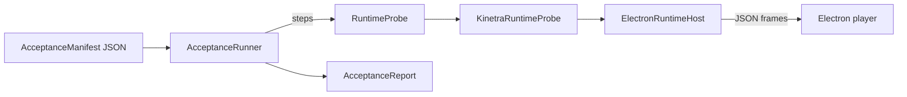

# @kinetra/verification

The completion gate for AI-authored games.

A task is not complete because code compiled or a screenshot looked plausible. Acceptance manifests drive semantic input and verify structured state, logs, screenshots, metrics, performance budgets, and packaged executables.

## How it fits together



* **Manifest** (`acceptanceManifestSchema`, zod, `.strict()`): `{ schemaVersion: 1, suite, seed?, target: "runtime" | "packaged", steps[] }`. Unknown keys or step types are rejected.
* **`AcceptanceRunner`** runs the steps in order and stops at the first failure. The report is machine-readable: `passed`, per-step `StepResult` (`expected`, `actual`, `diagnostics` listing the available keys when a path is missing), `failedSteps`, `failureReason`. If the runtime was started it is always stopped, even after a failure.
* **`RuntimeProbe`** is the only thing the runner talks to. Only `start`, `stop`, `input`, `wait`, `snapshot`, `logs`, `captureFrame` and `metrics` are mandatory.
* **Optional probe methods fail loudly.** A step whose probe method is missing (for example `animation.play` on a probe without `playAnimation`) fails with `UNSUPPORTED_STEP` instead of passing silently (#122, #142).
* **`KinetraRuntimeProbe`** adapts a `RuntimeProbeHost` (usually `ElectronRuntimeHost`, which launches the real player, or the packaged executable found by `resolvePackagedExecutable`) to that interface.

## Step types

| Group | Steps |
| --- | --- |
| Lifecycle | `runtime.start` (`sceneId`, `assets?`), `runtime.stop`, `runtime.pause`, `runtime.resume`, `runtime.step` (`steps?`, `deltaSeconds?`), `wait` |
| Input | `input` (`action`, `phase: press \| release \| hold`, `value?`, `durationMs?`) |
| Assets | `asset.register` |
| Animation | `animation.play`, `animation.stop` |
| Audio | `audio.play`, `audio.stop`, `audio.setBusGain`, `audio.setBusMuted` |
| Navigation | `navigation.bake`, `navigation.load`, `navigation.closestPoint`, `navigation.computePath` |
| Save | `save.capture`, `save.load` |
| State assertions | `assert.equal` / `assert.near` (dot `path` into the snapshot), `assert.logAbsent` (`minimumLevel`), `assert.metricMin`, `assert.metricMax` |
| Screenshots | `assert.screenshotSha256`, `assert.screenshotValidPng`, `capture.frame` (`id`) |
| Visual | `assert.visualNotBlank`, `assert.visualSimilarity`, `assert.visualDifference` (compare two `capture.frame` ids by changed-pixel ratio, perceptual dHash distance and mean absolute difference), `critique.visual` (AI critique through a `VisualCritiqueProvider`; `FakeVisualCritiqueProvider` for tests) |
| Performance | `performance.sample`, `assert.performanceBudget` (per-platform budgets, p50/p95/p99 frame times) |

## Entry points

| Export | Kind | What it does |
| --- | --- | --- |
| `acceptanceManifestSchema`, `acceptanceStepSchema` | zod schemas | Parse untrusted manifests. `AcceptanceManifestInput` is the input type. |
| `AcceptanceRunner` | class | `new AcceptanceRunner(probe, { artifactDir?, critiqueProvider? }).run(manifest)` → `AcceptanceReport`. |
| `KinetraRuntimeProbe` | class | `RuntimeProbe` over a `RuntimeProbeHost`. |
| `ElectronRuntimeHost`, `canRunRealElectronTests`, `realElectronLaunchArgs` | class / helpers | Launch the player under Electron (pipe or stdio transport) and speak the JSON bridge. Linux CI uses `xvfb-run`. |
| `resolvePackagedExecutable`, `packagedExecutableRelativePath`, `packagedBuildCommand`, `isPackagedExecutableAvailable` | functions | Find the packaged player build; infrastructure problems raise `InfrastructureError` with a stable `code` (for example `CONFIGURED_EXECUTABLE_NOT_FOUND`); `KINETRA_RUNTIME_EXECUTABLE` overrides the path. |
| `runProcessSmoke` | function | Spawn an executable with a timeout and return `{ exitCode, stdout, stderr, durationMs }`. |
| `decodePng`, `encodePng`, `dHash`, `hammingDistance`, `calculateVisualEvidence`, `compareVisualFrames`, `detectBlankFrame` | functions | Pure PNG analysis behind the visual steps; failures are `VisualError` with a stable `code`. |
| `createVisualBaselineFile`, `createVisualBaselineEntry`, `checkVisualBaselines`, `updateVisualBaselines`, `formatVisualBaselineReport`, `parseVisualBaselineFile`, `serializeVisualBaselineFile`, `loadVisualBaselineFile`, `saveVisualBaselineFile`, `writeVisualBaselineArtifacts`, `isCiEnvironment`, `VisualBaselineError` | functions / class | Long-term visual baselines (#100): per named frame a sha256, dHash and size. `check` is pure and never writes; `update` is the only way to change a baseline. See below. |
| `calculatePercentiles`, `evaluatePerformanceBudget`, `resolveBudgetForPlatform`, `writePerformanceReport` | functions | Frame-time statistics and budget checks behind the performance steps. |

## Example

A tiny in-memory probe is enough to run a manifest. Real games use `KinetraRuntimeProbe` over the Electron host instead.

```ts doc-check
import assert from "node:assert/strict";
import {
  AcceptanceRunner,
  acceptanceManifestSchema,
  type RuntimeInput,
  type RuntimeLog,
  type RuntimeProbe,
  type RuntimeSnapshot,
} from "@kinetra/verification";

class CounterProbe implements RuntimeProbe {
  snapshotValue: RuntimeSnapshot = { running: false, state: { score: 0 } };
  async start(sceneId: string): Promise<void> {
    this.snapshotValue = { running: true, sceneId, state: { score: 0 } };
  }
  async stop(): Promise<void> {
    this.snapshotValue = { ...this.snapshotValue, running: false };
  }
  async input(event: RuntimeInput): Promise<void> {
    if (event.action === "collect") {
      this.snapshotValue.state.score = Number(this.snapshotValue.state.score) + 1;
    }
  }
  async wait(): Promise<void> {}
  async snapshot(): Promise<RuntimeSnapshot> {
    return structuredClone(this.snapshotValue);
  }
  async logs(): Promise<RuntimeLog[]> {
    return [{ level: "info", message: "ready" }];
  }
  async captureFrame(): Promise<Uint8Array> {
    return new Uint8Array([1, 2, 3]);
  }
  async metrics(): Promise<Record<string, number>> {
    return { fps: 60 };
  }
}

// Manifests are plain JSON: validate before running.
const manifest = acceptanceManifestSchema.parse({
  schemaVersion: 1,
  suite: "collect-orb",
  steps: [
    { type: "runtime.start", sceneId: "main" },
    { type: "input", action: "collect", phase: "press" },
    { type: "assert.equal", path: "state.score", expected: 1 },
    { type: "assert.logAbsent", minimumLevel: "error" },
    { type: "assert.metricMin", metric: "fps", min: 30 },
    { type: "runtime.stop" },
  ],
});
const passed = await new AcceptanceRunner(new CounterProbe()).run(manifest);
assert.equal(passed.passed, true);
assert.equal(passed.steps.length, 6);

// A wrong expectation fails with the actual value and stops the run.
const failed = await new AcceptanceRunner(new CounterProbe()).run({
  ...manifest,
  steps: [
    { type: "runtime.start", sceneId: "main" },
    { type: "assert.equal", path: "state.score", expected: 5 },
    { type: "runtime.stop" },
  ],
});
assert.equal(failed.passed, false);
assert.equal(failed.steps.length, 2);
assert.equal(failed.steps[1]?.actual, 0);

// A step the probe cannot perform is a failure, not a silent pass.
const unsupported = await new AcceptanceRunner(new CounterProbe()).run({
  ...manifest,
  steps: [
    { type: "runtime.start", sceneId: "main" },
    { type: "animation.play", entityId: "hero", clip: "Run" },
  ],
});
assert.equal(unsupported.passed, false);
assert.match(unsupported.failureReason ?? "", /UNSUPPORTED_STEP/);

// Unknown step types are rejected before anything runs.
assert.throws(() =>
  acceptanceManifestSchema.parse({ schemaVersion: 1, suite: "x", steps: [{ type: "teleport" }] }),
);
```

## Visual baselines

A baseline file (`schemaVersion: 1`) stores, per frame name, the PNG's `sha256`, its 64-bit `perceptualHash` (dHash) and `width`/`height`, sorted by name so diffs are stable. `checkVisualBaselines` reports one status per frame:

| Status | Meaning | Passes |
| --- | --- | --- |
| `identical` | Same PNG bytes as the baseline | yes |
| `similar` | Different bytes, same size, dHash distance within tolerance (default `DEFAULT_BASELINE_HASH_TOLERANCE` = 8 of 64 bits) | yes |
| `mismatch` | Size changed or dHash beyond tolerance | no |
| `missing` | No baseline recorded yet, so a new frame cannot slip through un-reviewed | no |

`updateVisualBaselines` needs `confirm: true` and throws `baseline.updateForbiddenInCi` when `isCiEnvironment()` sees a CI marker, so CI can never auto-accept a regression. Errors are `VisualBaselineError` with a stable `code` (`baseline.invalidFile`, `baseline.invalidName`, `baseline.updateNotConfirmed`, ...). Frame names match `/^[A-Za-z0-9][A-Za-z0-9._-]{0,127}$/`.

```ts doc-check
import assert from "node:assert/strict";
import {
  VisualBaselineError,
  checkVisualBaselines,
  createVisualBaselineFile,
  encodePng,
  formatVisualBaselineReport,
  updateVisualBaselines,
  type VisualFrame,
} from "@kinetra/verification";

function halves(flip: boolean): Uint8Array {
  const width = 32;
  const height = 32;
  const data = new Uint8Array(width * height * 4);
  for (let y = 0; y < height; y++) {
    for (let x = 0; x < width; x++) {
      const value = (x < width / 2) !== flip ? 20 : 235;
      data.set([value, value, value, 255], (y * width + x) * 4);
    }
  }
  return encodePng({ width, height, data });
}

const frames: VisualFrame[] = [{ name: "menu", bytes: halves(false) }];

// A new frame has no baseline: that is a failure until someone accepts it on purpose.
const empty = createVisualBaselineFile();
assert.equal(checkVisualBaselines(empty, frames).results[0]?.status, "missing");

// Accepting a baseline is explicit, and refused under CI.
assert.throws(
  () => updateVisualBaselines(empty, frames, { confirm: true, env: { CI: "true" } }),
  (error) => error instanceof VisualBaselineError && error.code === "baseline.updateForbiddenInCi",
);
const { file, added } = updateVisualBaselines(empty, frames, { confirm: true, env: {} });
assert.deepEqual(added, ["menu"]);

// The same bytes are identical; a mirrored frame is a mismatch with a readable report.
assert.equal(checkVisualBaselines(file, frames).results[0]?.status, "identical");
const regression = checkVisualBaselines(file, [{ name: "menu", bytes: halves(true) }]);
assert.equal(regression.passed, false);
assert.equal(regression.results[0]?.status, "mismatch");
assert.match(formatVisualBaselineReport(regression), /FAIL/);
```

The same operations are available as a CLI (`pnpm --filter @kinetra/verification visual-baseline check|update`):

```text
visual-baseline check  <baselines.json> <frames-dir> [--report-dir <dir>] [--tolerance <0..64>]
visual-baseline update <baselines.json> <frames-dir> --confirm [--only <name,name>]
```

`<frames-dir>` holds PNG files; each file name without `.png` is the frame name. `check` exits 1 on any failing frame and, with `--report-dir`, writes the report plus diff artifacts; `update` is the only command that changes baselines. The baselines are not yet wired into `AcceptanceRunner` or CI with frames captured from the real Electron player (#100 still open).

## Proof level

| Capability | Proof |
| --- | --- |
| Runner semantics, step failures, unsupported steps | `verification.test.ts`, `runner-steps.test.ts`, `unsupported-step.test.ts` (no Electron needed) |
| Visual analysis, critique, performance maths | `visual.test.ts`, `visual-property.test.ts`, `critique.test.ts`, `performance.test.ts` |
| Visual baselines (library and CLI) | `visual-baseline.test.ts`, `visual-baseline-cli.test.ts` (no Electron needed; both listed in the package `test` script) |
| Probe over a host, packaged resolver, transport | `runtime-probe.test.ts`, `packaged-resolver.test.ts`, `electron-transport.test.ts` |
| Real Electron player (runtime, physics, navigation, models, animation, audio, save/load, IK, hot reimport, performance, visual) | `real-*.test.ts`, listed in the package `test` script; they need Electron (`xvfb-run -a` on Linux) and skip themselves where Electron cannot launch |
| Packaged executables | Linux packaged player smoke and Windows package in CI; the acceptance gate against the packaged build is `target: "packaged"` |

Run the suite with `pnpm --filter @kinetra/verification test` (over 10 minutes with Electron).

Perceptual image comparison is deterministic (dHash + pixel statistics); AI visual critique is an adapter (`VisualCritiqueProvider`) and is only a hard gate when `requireProvider` is set.
